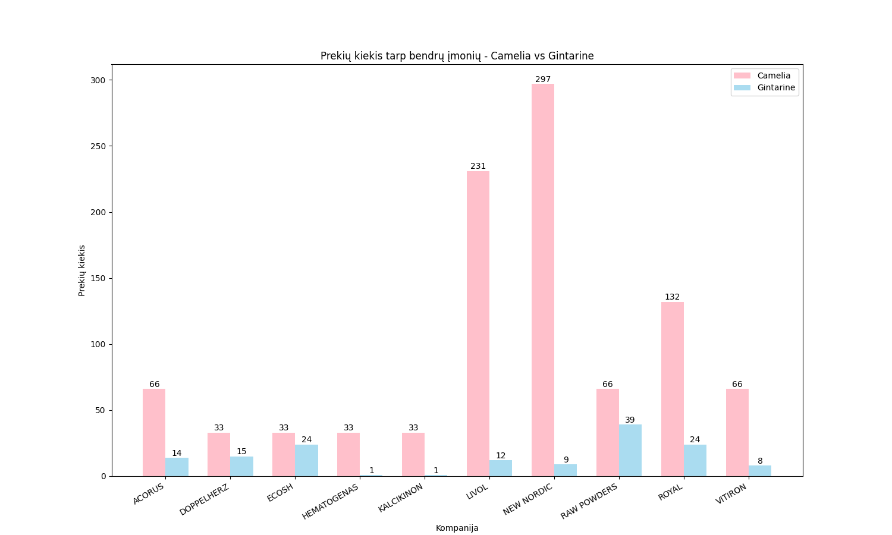
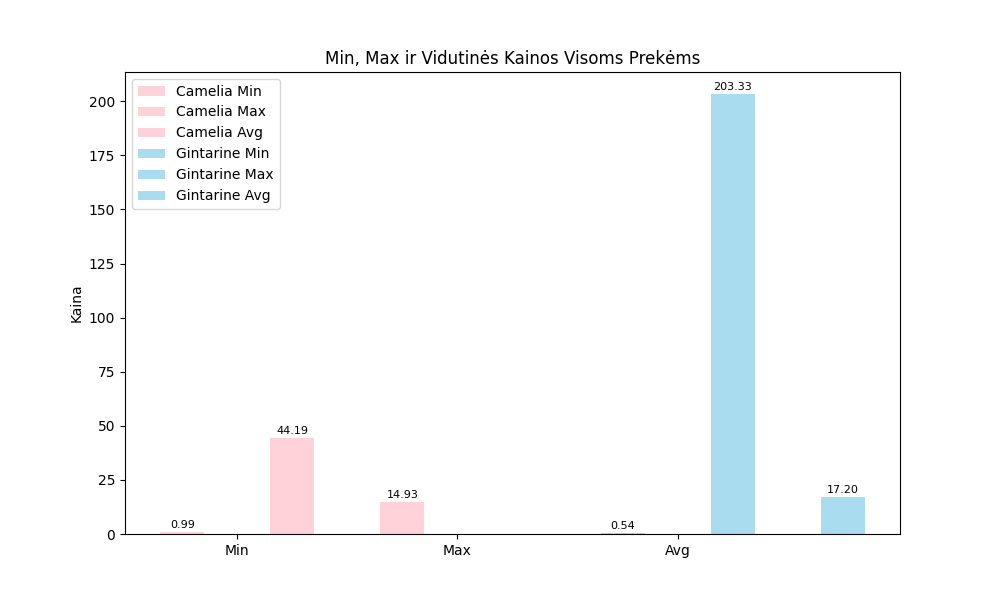
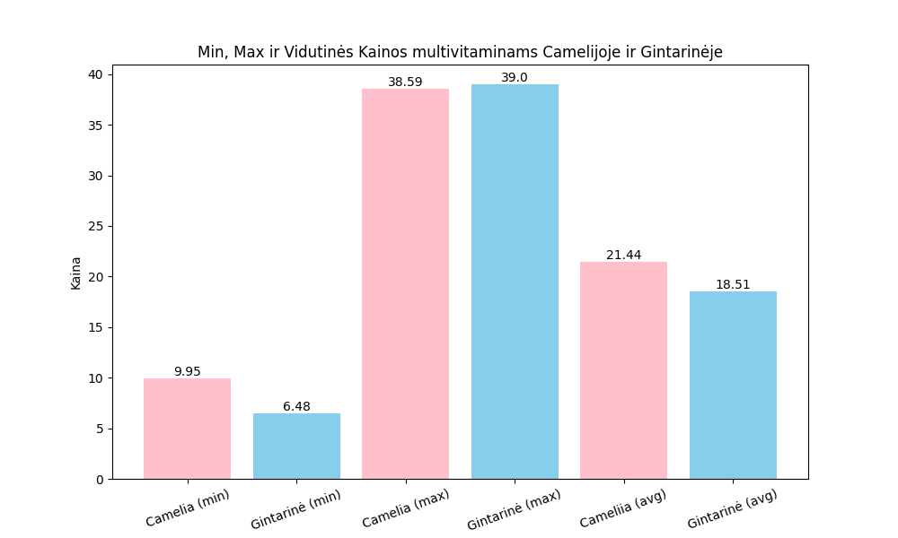
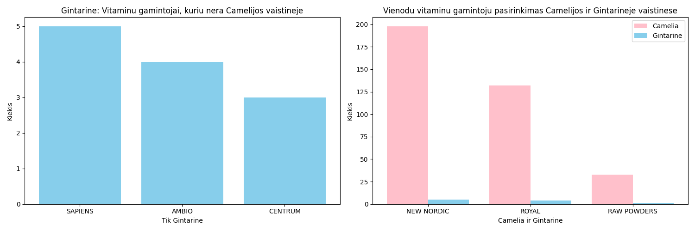
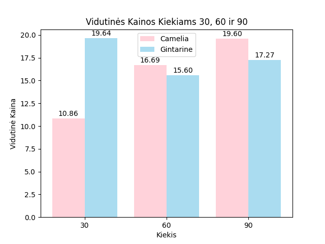

FINAL PROJECT!
Projekto Pavadinimas: Vaistų Kainų Palyginimas Internetinėse Vaistinėse
Projektą atliko Alina Hancharenka ir Rūta Kudeliovaitė.
Projektas skirtas Vilnius Coding School baigiamajam darbui.
Projekto tikslas yra įgyvendinti pirmajį projektą Python programa. Pasirinkto projekto tikslas buvo pasirinkti dvi elektroninės vaistinės ir sulyginti produktų kainas.
Atsižvelgiant į faktą, kad vaistinėse vitaminų daugiau nei vaistų, pasirinkome vitamigu kategoriją.
Pasirenkant dvi populiarias Lietuvoje vaistines: "Gintarinė vaistinė" ir "Camelia".
Pirminis tikslas ištraukti iš tinklaraščio projektui reikiamą medžiagą. Ir sutvarkius duomenis naudojantis pandas biblioteka sukurti palyginančius grafikus.

Pirminis žingsnis buvo ištraukti reikiamą informaciją iš internetinių vaistinių naudojant Python programą. Buvo naudojamos pandas ir BeautifulSoup bibliotekos. Kadangi vaistinės turi po 'x' skaičių puslapių, buvo naudojama komanda 'in range', kad informacija būtų nuskaitoma iš visų puslapių, ne tik pirmojo. Rinant informaciją iš Gintarinio puslapio, paaiškėjo, kad kai kurios prekės yra apibrėžtos kaip priklausančios akcijinėms, bet neturi nurodytos akcijos kainos, todėl į tą vietą yra paimama sekančios prekės kaina su nuolaida. Teko spręsti kainos vaiduoklio problemą. Todėl duomenys iš Gintarinės vaistinės buvo imami individualiai kiekvienam produktui ir jungiami į bendrą duomenų bazę. Tokiu būdu išsprendėme kainos vaiduoklio problemą. Puslapis Camelia pateikė skirtingas klases įprastinei kainai, kai produktas yra su akcija ar be jos, todėl buvo naudojama apibrėžti len funkcija, kad galėtume surinkti įprastines kainas visiems produktams. Failai pavadinti camelia.py ir gintarine.py.

company_gintarine.py ir company_camelia.py kodai skirti pirminiam duomenų sutvarkymui. Ištraukdamos informaciją, sukūrėme trijų stulpelių failus: 'Pavadinimas', 'Iprastinė kaina' ir 'Kaina su nuolaida'. Stulpelis 'Pavadinimas' turėjo visą likusią informaciją, kurios mums reikėjo projektui. Iš stulpelio 'Pavadinimas' sukūrėme 'Kompanija', 'Vaistų pavadinimas' ir 'Kiekis'. Stulpeliui 'Kompanija' panaudojome pirmąjį žodį, jei žodis yra iš trijų ar mažiau raidžių, pridėjome antrąjį žodį. Stulpeliui 'Kiekis' naudojome paskutinę skaičių grupę esančią tekste. Abiem atvejais panaudoti duomenis buvo pašalinami iš teksto. O visa kita, kas liko, palikome stulpelyje 'Vaistų pavadinimas'.

Kai jau manėme, kad susitvarkėme visus duomenis ir liko tik palyginti kainas, supratome, kad neturime ką lyginti. Vaistinėse prekiaujama skirtingų kompanijų vitaminų. Turėdami iš abiejų kompanijų kiekius po beveik 1500, nei vienas pavadinimas nesutapo. Radome 10 sutampančių kompanijų. Tačiau vitaminų kiekiai labai skyrėsi, todėl ir tuo remiantis negalėjome kainų sulyginti, nes neatrodė, kad tai būtų verta dėmesio.

Išsigilinusios į turimus modified_camelia.csv ir modified_gintarine.csv failus, radome raktinį žodį 'multivitaminai'. Ištraukėme iš stulpelio 'Vaistų pavadinimas' visus duomenis, kuriuose buvo žodis 'multivitaminai', ir apjungėme juos į naują DataFrame. Sukūrus DataFrame, pastebėjome, kad turime nemažai duomenų. Tačiau paaiškėjo, kad viena vaistinė turi gerokai daugiau vitaminų su raktiniu žodžiu 'multivitaminai' nei kita.

Ir pabaigai, bendram kainų palyginimui, remiantis tik pakuotės kiekiais, kuriuose yra 30 vnt, 60 vnt ir 90 vnt, abiejose vaistinėse.

Apibendrinimas:
Šį projektą atlikant daug kartų džiaugėmės, pamačiusios kokius nors rezultatus, bet taip pat ir daug kartų nusivylėme, kai įsigilinom į juos. Kai jau manėme, kad baiginejame projektą, pastebėjome, kad pirminis failas surinko duomenis neteisingai, išsiaiškinome apie naują terminą 'ghosted price' todėl teko grįžti prie pirminio failo ir jį koreguoti. Daug kartų teko suvokti, kad informacija, kurią manėme turinčios, yra arba neteisinga, arba netinkama. Darant grafikus suvokėme, kad jie galvoje susiprojektuoja kur kas lengviau nei realybėje. Tačiau iš turimų duomenų sugebėjome palyginti bendrą kainų vidurkį, mažiausias ir didžiausias kainas, kurios grafike atvaizduoja labai didelį kontrastą. Tačiau turime paminėti, kad duomenys nėra labai tikslūs dėl to, kad vaistinės prekiauja skirtingų kompanijų produkcija. Du pagrindinius sąlyčio taškus sudarė: raktinis žodis 'multivitaminai' ir pakuočių kiekiai, kuriuos ir atvaizdavome. Reziumé, nepaisant to, kad negalime pateikti patikimo kainų palyginimo tarp to paties produkto vaistinėse, šio projekto metu išmokome mąstyti 'outside the box'. 

Šiam projektui buvo naudojama informacija, kurią radome įvairiuose forumuose ir remiantis įvairiais puslapiais apie Python programas.

